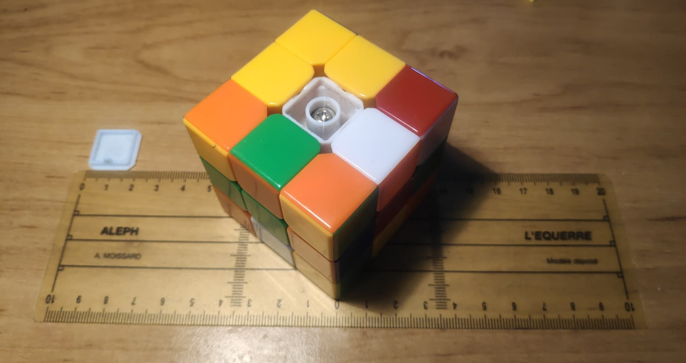
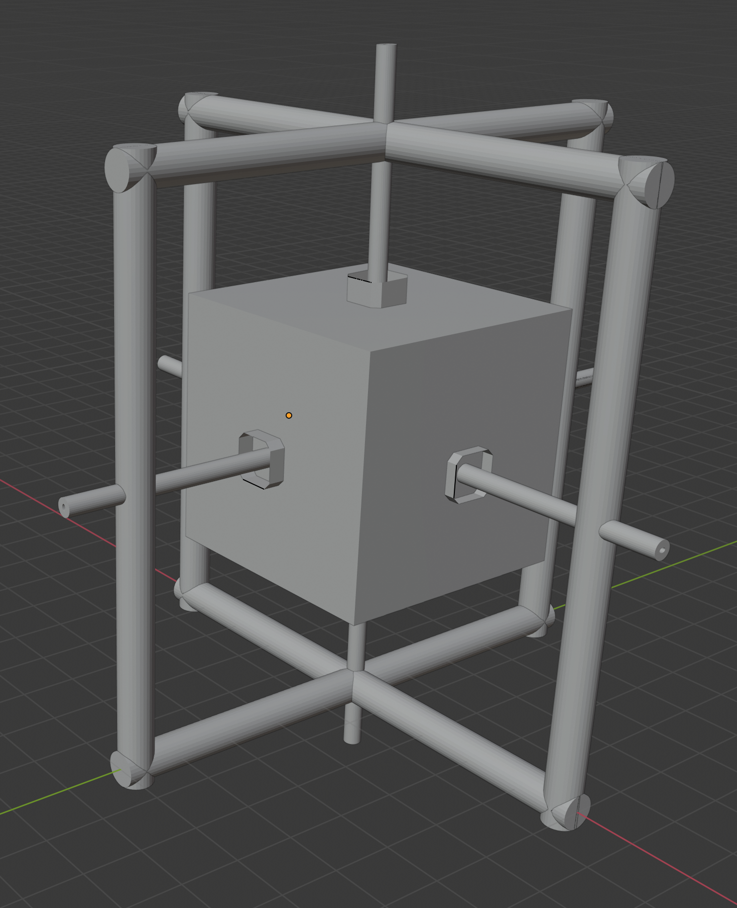
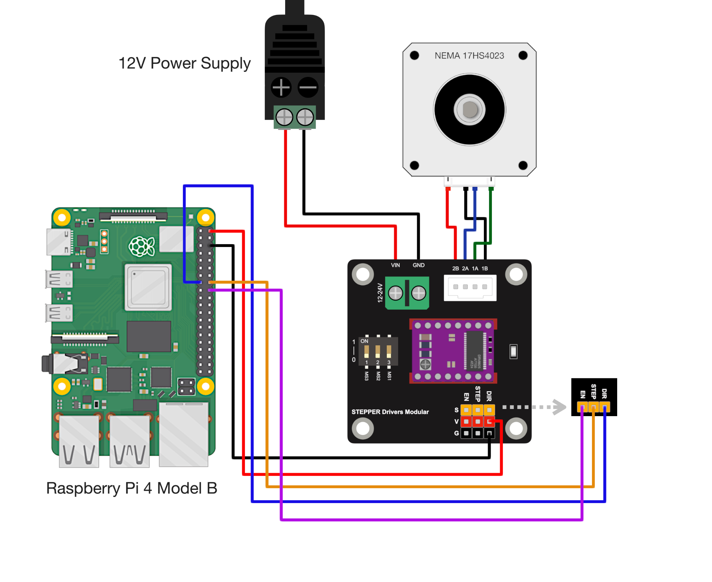
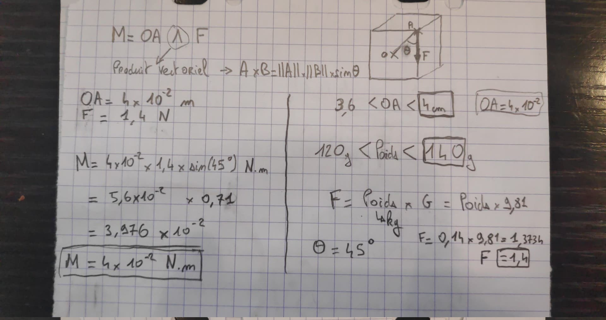

# Constructing a robot to solve the Rubik's bot

[Dayan GuHong 3x3 Cube de vitesse](https://www.amazon.fr/gp/product/B00BS1I8RM/)

Alternative: [Dayan Cube](https://www.amazon.fr/gp/product/B06XDM9F2W)

| dimension		         | min   | max  |
|:-----------------------|:-----:|:----:|
| **size** in *cm*       |5.65   | 5.65 |
| **weight** in *grams*     |50     | 100  |
| **cube size** in *cm* |1.8    |   1.9|
 

# Robot design

We decided to inspire ourselves from the current world record for rubiks cube solving (click on image to see video of a resolution):

We did not look for plans or schemas online of their solution as we wanted to solve these details ourselves

# Choosing Parts

Basic architecture of the wiring for:

 -  Rasberry Pi 
 -  Driver 
 -  Motor 
 -  Alimentation

[https://makersportal.com/blog/raspberry-pi-stepper-motor-control-with-nema-17](https://makersportal.com/blog/raspberry-pi-stepper-motor-control-with-nema-17)

## Motor 

### Testing the weight needed

1. The Paprika bottle weights 120g 
2. The Cream box weights 140g 

| Weigths: | 120g    | 140g    |
|:---------|:-------:|:-------:|
| Results: |FAILURE | SUCCESS |
  
 

### Calcul of the moment needed to rotate one face of the Rubik's Cube

### Conclusion

 - We need a motor with a moment of 4 N.cm

 - Here is a motor of 40N.cm (with it's driver) we will use for testing: [Nema 17](https://www.amazon.fr/Quimat-Imprimante-Stepper-56-2oz-Segments/dp/B06XT3HKRX)

|Stepper motor Specification | Value
|:-|-:|
|Manufacturer Part Number: |17HS4401|
|Motor Type: | Bipolar Stepper|
|Step Angle: | 1.8 deg.|
|Holding Torque: | 40Ncm(56.2oz.in)|
|Voltage | 24V |
|Rated Current/phase: | 1.7A|
|Frame Size: |42 x 42mm|
|Body Length: |40mm|
|Shaft Diameter: |5mm|
|Number of Leads: |4|
|Weight: |280g|

 

|Stepper Driver Specification | Value |
|:-|-:|
|Supply Voltage | 9V-40V DC|
|Max output current | 4.0A|
|For step motor | 42, 57, 86 type 2 phase 4 phase (4 / 6 / 8 line)|

 

## Alimentation

### Basics

- Voltage
  - The difference in charge between the two points
  - **Voltage is supplied**
- Current 
  - The flow of electrical charges
  - **Current is drawn**

How to choose power supply for electronic project [SeedStudio](https://www.seeedstudio.com/blog/2021/01/22/how-to-power-supply-for-projects/)

Formulas:

- Power:
	- 

       - P = Power (Watt)
       - I = current (Ampere)
       - V = voltage (Volt)

- Ohm's law
	- 

       - V = voltage (Volt)
       - I = current (Ampere)
       - R = resistance (Ohm)

For a motor taking 24V/1.7A = 40.8 Watts

This alimentation will allow for testing: 

[Alimentation 110/220V DC 24V 15A 360W](https://www.amazon.fr/NEWSTYLE-Convertisseur-commutation-dalimentation-informatique/dp/B0758BNMLH/)

It gets 24V out and allows to get out up to 360W. Amperes seems to not matter as they are defined by the 'receiving appliance'